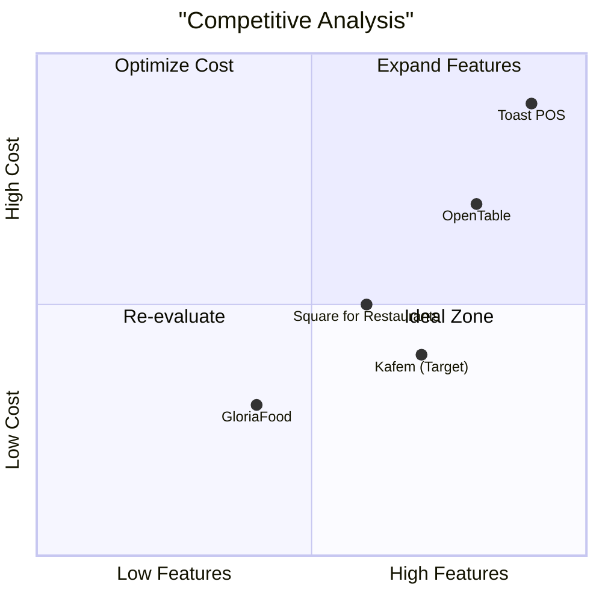

# Product Requirements Document (PRD)

## Language & Project Info
- **Language**: Azerbaycan Türkçəsi
- **Programming Language**: Flask
- **Project Name**: smart_cafe
- **Restated Requirements**: 
  - Develop a professional restaurant ordering system with the following features:
    - Token-based security
    - Role-based management system
    - Photo menu
    - QR code functionality
    - Revenue tracking
    - Mobile compatibility
    - Simple graphics
    - Security measures

## Product Definition

### Product Goals
1. Ensure secure and efficient restaurant operations through token-based security and role-based management.
2. Enhance user experience with a photo menu, QR code functionality, and mobile compatibility.
3. Provide actionable insights with revenue tracking and detailed reporting.

### User Stories
1. As a **customer**, I want to scan a QR code to access the menu and place orders securely so that I can enjoy a seamless dining experience.
2. As a **restaurant owner**, I want to manage my menu, tables, and staff efficiently so that I can focus on improving customer satisfaction.
3. As an **admin**, I want to oversee all restaurants and manage tokens and roles so that I can ensure system-wide security and functionality.
4. As a **waiter**, I want to view and mark orders as ready so that I can serve customers efficiently.
5. As a **restaurant owner**, I want to track my restaurant's revenue with daily, weekly, and monthly filters so that I can make informed business decisions.

### Competitive Analysis
| Product Name       | Pros                                      | Cons                                  |
|--------------------|-------------------------------------------|---------------------------------------|
| OpenTable          | Comprehensive reservation system          | Limited customization for small cafes |
| Toast POS          | Robust POS and management features        | Expensive for small businesses        |
| Square for Restaurants | Easy to use and affordable            | Limited advanced features             |
| GloriaFood         | Free and user-friendly                   | Lacks advanced analytics              |
| Kafem (Target) | Secure, role-based, photo menu, QR-based  | Requires initial setup and training   |

## Technical Specifications

### Requirements Analysis
- **Token-based Security**: Unique tokens for each table, admin-controlled, invisible in URLs.
- **Role-based Management**: Admin, restaurant owner, and waiter roles with specific permissions.
- **Photo Menu**: Optimized images with product details.
- **QR Code Functionality**: Directs to secure table-specific pages.
- **Revenue Tracking**: Filtered by daily, weekly, and monthly periods.
- **Mobile Compatibility**: Responsive design for seamless use on mobile devices.
- **Security Measures**: IP logging, request rate limiting, and token validation.

### Requirements Pool
- **P0 (Must-have)**:
  - Token-based security
  - Role-based management
  - QR code functionality
  - Revenue tracking
  - Security measures
- **P1 (Should-have)**:
  - Photo menu
  - Mobile compatibility
- **P2 (Nice-to-have)**:
  - Advanced analytics for revenue tracking

### UI Design Draft
- **Customer View**: QR code scanning, menu display, order placement.
- **Admin Panel**: Token management, role assignment, revenue overview.
- **Restaurant Owner Panel**: Menu management, table setup, logo customization, waiter management.

### Open Questions
1. Should the system support multiple languages beyond Azerbaycan Türkçəsi?
2. Are there any specific design preferences for the mobile interface?
3. Should the revenue tracking include exportable reports?