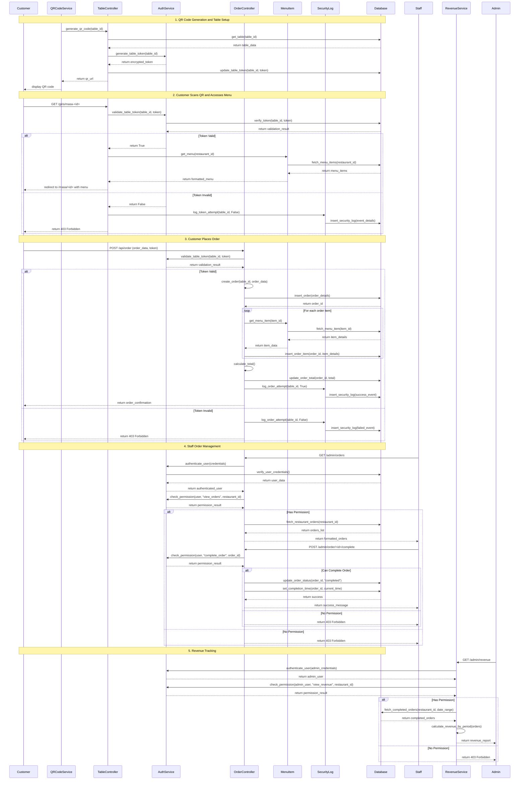

# Kafem System Design

## Implementation approach

Kafem sistemi Flask web framework'ü kullanarak geliştirilecek profesyonel bir restoran sipariş yönetim sistemidir. Sistem aşağıdaki temel zorlukları çözecek şekilde tasarlanmıştır:

### Teknik Zorluklar ve Çözümler:

1. **Token Tabanlı Güvenlik**: Her masa için benzersiz token'lar oluşturulacak ve Flask-JWT-Extended kullanılarak güvenlik sağlanacak
2. **Rol Tabanlı Erişim**: Flask-Login ve Flask-Principal ile rol tabanlı yetkilendirme sistemi
3. **Fotoğraf Yönetimi**: Pillow kütüphanesi ile görsel optimizasyonu ve AWS S3/MinIO ile dosya depolama
4. **QR Kod Üretimi**: qrcode kütüphanesi ile dinamik QR kod oluşturma
5. **Mobil Uyumluluk**: Bootstrap 5 ile responsive tasarım
6. **Güvenlik**: Flask-Limiter ile rate limiting ve güvenlik logları

### Kullanılacak Açık Kaynak Kütüphaneler:

- **Flask**: Ana web framework
- **Flask-SQLAlchemy**: ORM ve veritabanı yönetimi
- **Flask-Login**: Kullanıcı oturum yönetimi
- **Flask-JWT-Extended**: Token tabanlı kimlik doğrulama
- **Flask-Principal**: Rol tabanlı yetkilendirme
- **Flask-Limiter**: Rate limiting
- **Flask-WTF**: Form güvenliği ve validasyon
- **Pillow**: Görsel işleme
- **qrcode**: QR kod üretimi
- **Bootstrap 5**: Frontend framework
- **PostgreSQL/SQLite**: Veritabanı

## Data structures and interfaces

```mermaid
classDiagram
    class User {
        +int id
        +str username
        +str email
        +str password_hash
        +str role
        +int restaurant_id
        +datetime created_at
        +bool is_active
        +__init__(username: str, email: str, password: str, role: str)
        +set_password(password: str) void
        +check_password(password: str) bool
        +has_role(role: str) bool
    }

    class Restaurant {
        +int id
        +str name
        +str description
        +str logo_url
        +str address
        +str phone
        +datetime created_at
        +bool is_active
        +__init__(name: str, description: str)
        +get_tables() List[Table]
        +get_menu_items() List[MenuItem]
        +calculate_revenue(start_date: date, end_date: date) float
    }

    class Table {
        +int id
        +int restaurant_id
        +int table_number
        +str token
        +datetime token_created_at
        +bool is_active
        +__init__(restaurant_id: int, table_number: int)
        +generate_token() str
        +validate_token(token: str) bool
        +get_qr_code() str
    }

    class MenuItem {
        +int id
        +int restaurant_id
        +str name
        +str description
        +float price
        +str image_url
        +bool is_available
        +datetime created_at
        +__init__(restaurant_id: int, name: str, price: float)
        +upload_image(image_file) str
        +optimize_image(image_path: str) str
    }

    class Order {
        +int id
        +int table_id
        +int restaurant_id
        +str customer_name
        +float total_amount
        +str status
        +datetime created_at
        +datetime completed_at
        +str client_ip
        +str user_agent
        +__init__(table_id: int, customer_name: str)
        +add_item(menu_item_id: int, quantity: int) void
        +calculate_total() float
        +mark_completed() void
        +generate_receipt() dict
    }

    class OrderItem {
        +int id
        +int order_id
        +int menu_item_id
        +int quantity
        +float unit_price
        +float total_price
        +__init__(order_id: int, menu_item_id: int, quantity: int, unit_price: float)
        +calculate_total() float
    }

    class SecurityLog {
        +int id
        +str event_type
        +str ip_address
        +str user_agent
        +str details
        +datetime timestamp
        +__init__(event_type: str, ip_address: str, details: str)
        +log_token_attempt(token: str, success: bool) void
        +log_order_attempt(table_id: int, success: bool) void
    }

    class AuthService {
        +generate_table_token(table_id: int) str
        +validate_table_token(table_id: int, token: str) bool
        +authenticate_user(username: str, password: str) User
        +check_permission(user: User, action: str, resource_id: int) bool
    }

    class QRCodeService {
        +generate_qr_code(table_id: int) str
        +create_table_url(table_id: int) str
        +save_qr_image(qr_code: str, table_id: int) str
    }

    class RevenueService {
        +calculate_daily_revenue(restaurant_id: int, date: date) float
        +calculate_weekly_revenue(restaurant_id: int, start_date: date) float
        +calculate_monthly_revenue(restaurant_id: int, year: int, month: int) float
        +get_revenue_report(restaurant_id: int, period: str) dict
    }

    class OrderController {
        +create_order(table_id: int, token: str, order_data: dict) Order
        +get_order_status(order_id: int) str
        +complete_order(order_id: int, user: User) bool
        +get_restaurant_orders(restaurant_id: int, user: User) List[Order]
    }

    class MenuController {
        +create_menu_item(restaurant_id: int, item_data: dict, user: User) MenuItem
        +update_menu_item(item_id: int, item_data: dict, user: User) MenuItem
        +delete_menu_item(item_id: int, user: User) bool
        +get_menu(restaurant_id: int) List[MenuItem]
    }

    class TableController {
        +create_table(restaurant_id: int, table_number: int, user: User) Table
        +regenerate_token(table_id: int, user: User) str
        +get_table_qr(table_id: int, user: User) str
        +validate_table_access(table_id: int, token: str) bool
    }

    %% Relationships
    User ||--o{ Restaurant : owns
    Restaurant ||--o{ Table : has
    Restaurant ||--o{ MenuItem : has
    Table ||--o{ Order : receives
    Order ||--o{ OrderItem : contains
    MenuItem ||--o{ OrderItem : included_in
    User ||--o{ SecurityLog : generates
    AuthService ..> User : authenticates
    QRCodeService ..> Table : generates_qr
    RevenueService ..> Order : calculates
    OrderController ..> Order : manages
    MenuController ..> MenuItem : manages
    TableController ..> Table : manages
```

## Program call flow



## Anything UNCLEAR

Aşağıdaki konularda daha fazla açıklama gerekebilir:

1. **Fotoğraf Depolama**: Ürün fotoğraflarının yerel dosya sisteminde mi yoksa cloud storage'da mı saklanacağı belirtilmemiş. MinIO veya AWS S3 önerilir.

2. **Veritabanı Seçimi**: PostgreSQL production için önerilir, ancak development için SQLite de kullanılabilir.

3. **QR Kod Güncelleme Sıklığı**: Token'ların ne sıklıkla yenileneceği ve QR kodların yeniden üretilme politikası belirlenmeli.

4. **Mobil Uygulama**: Web tabanlı responsive tasarım mı yoksa native mobile app gereksinimi var mı açık değil.

5. **Ödeme Entegrasyonu**: Sipariş sisteminde ödeme işlemi dahil mi, yoksa sadece sipariş yönetimi mi yapılacak?

6. **Multi-tenant Architecture**: Birden fazla restoran için sistem nasıl scale edilecek?

7. **Bildirim Sistemi**: Sipariş durumu değişikliklerinde real-time bildirim gereksinimi var mı?

8. **Backup ve Recovery**: Veri yedekleme stratejisi ve disaster recovery planı?